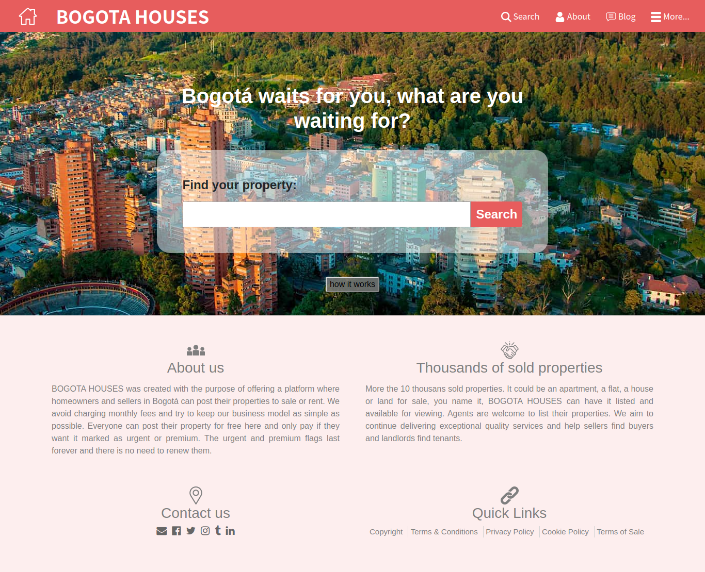
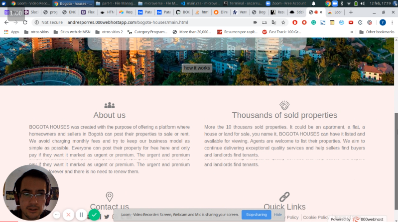

# BOGOTA HOUSES - capstone project

Eight Microverse Project by Oscar Russi.

## Usage

This project simulates the visual design of Real Estate listing and agency websites.

# What it does

- List of sale properties in Bogotá.
- main.html page contains a search form.
- The search form button redirects to properties.html, which shows a list of properties.
- Each image of a property redirects to sale-house.html which contains detailed information about a property and also a form to contact the property salesman.
- Design partially based on https://www.behance.net/gallery/25563385/PatashuleKE.
- Design partially based on https://houses.directory/.
- Design partially based on https://m.fincaraiz.com.co/.

# Features

- Created a total of three pages (main.html, properties.html, and sales-house.html).
- Using CSS Grid and flexbox for the layout of the three pages.
- Using Bootstrap for styling the forms elements.
- Using font-awesome for some icons.
- Using icons from flaticon.
- Responsive design for three different screen sizes (max 768, max 1024 and bigger screens).
- Using Noto Sans font (from google fonts).

## Built With

- HTML5.
- CSS3.
- Bootstrap.
- Font-awesome.
- Google fonts.

#### and deployed to GitHub

## Running tests

https://github.com/andresporras3423/bogota-houses/issues/3

## Planned Features

https://github.com/andresporras3423/bogota-houses/issues

## Live Demo

[Live Demo](http://andresporres.000webhostapp.com/bogota-houses/main.html)

## Project Presentation (VIDEO)

[Project Presentation](https://www.loom.com/share/e7d6fd61f9c646b69af27af1b3808a0a)

## Authors

**Oscar Russi**
- Github: [@andresporras3423](https://github.com/andresporras3423/)
- Linkedin: [Oscar Russi](https://www.linkedin.com/in/oscar-andres-russi-porras/)
- Twitter: [@OscarRussi1](https://twitter.com/OscarRussi1)

## 🤝 Contributing

This is a project for educational purposes only. We are not accepting contributions.

## Attributions and Credit

Special thanks to Microverse, for this learning opportunity. 

## Show your support

Give a ⭐️ if you like this project!

## Enjoy!
